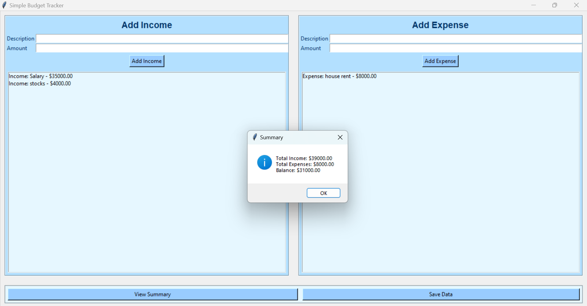

# cs50_Python_final_project

🧾 **Personal Finance Tracker**

📄 **Description:**

The **Personal Finance Tracker** is a Python application with a graphical user interface (GUI) designed to help you manage your personal finances. This application allows you to add expenses, record income, and view a summary of your financial status using an interactive and user-friendly GUI. Data is saved and loaded from a text file to persist your records between program runs. 🗂️


✨ **Features:**

- 💸 **Add Expense:** Record an expense with a description and amount.
- 💰 **Add Income:** Add income entries with a description and amount.
- 📊 **View Summary:** Display total income, total expenses, and the current balance.
- 💾 **Save Data:** Save your income and expense entries to a text file (`budget_data.txt`) for future use.
- 📂 **Load Data:** Automatically load saved data from `budget_data.txt` when the program starts.

🛠️ **How to Use:**

1. **Run the Program:** Execute `project.py` using Python.
   ```bash
   python project.py
   ```
2. **GUI Interface:** The application opens a window with:
   - Input fields to add expenses and income.
   - Buttons to add entries, view a summary, and save data.
   - Listboxes to display added expenses and income.
   
3. **Saving Data:** When you select "Save Data," the program writes all income and expenses to `budget_data.txt` for future use. 📂

## 📂 **Project Structure:**

- `project.py`: The main file containing the core logic and GUI of the budget tracker. It includes:
  - 🏁 `main()`: Sets up the GUI and its layout.
  - 💸 `add_expense()`: Adds an expense entry to the listbox and stores it in the data list.
  - 💰 `add_income()`: Adds an income entry to the listbox and stores it in the data list.
  - 📊 `view_summary()`: Calculates and displays the total income, expenses, and balance.
  - 💾 `save_data()`: Saves the current income and expense data to a text file.
  - 📂 `load_data()`: Loads saved data from a text file when the program starts.

- `test_project.py`: Contains automated tests for the main functions using `pytest`. It includes:
  - 🧪 `test_add_expense()`: Tests adding an expense to the list.
  - 🧪 `test_add_income()`: Tests adding income to the list.
  - 🧪 `test_view_summary()`: Tests the summary output using `capsys` to capture printed output.

- `requirements.txt`: Lists required libraries for running tests. In this project, it includes `pytest`. 📋

🧪 **Testing:**

This project uses the `pytest` framework to test core functions. To run the tests, execute the following command:
```bash
pytest test_project.py
```
The tests ensure that expenses and income are correctly added and that the summary displays accurate financial information. ✔️

🧩 **Design Choices:**

- **Data Persistence:** The project uses a text file (`budget_data.txt`) for simple data storage, allowing for easy implementation and demonstration of file handling in Python. 🗄️
- **Testing:** The use of `pytest` helps validate the functionality of adding expenses, income, and viewing the summary, ensuring the reliability of core features. 🧪
- **User Interface:** A graphical user interface (GUI) with Tkinter was chosen for a more interactive and user-friendly experience. 🖥️

🚀 **Future Enhancements:**

- 🖼️ Add more advanced features such as expense categories and monthly budgeting.
- 📊 Allow data export to formats like CSV for external analysis.
- 🗂️ Implement additional improvements based on user feedback.

📋 **Requirements:**

- 🐍 Python 3.x
- 🧪 `pytest` for testing (listed in `requirements.txt`)
- 📦 `tkinter` for the GUI (usually included with Python installations)

🏃 **How to Run:**

1. Clone or download the project to your local machine. 💻
2. Navigate to the project's root directory.
3. Run the program:
   ```bash
   python project.py
   ```
4. Interact with the GUI to add income, expenses, and view your summary.

Feel free to explore and extend the project as needed! 🎉

